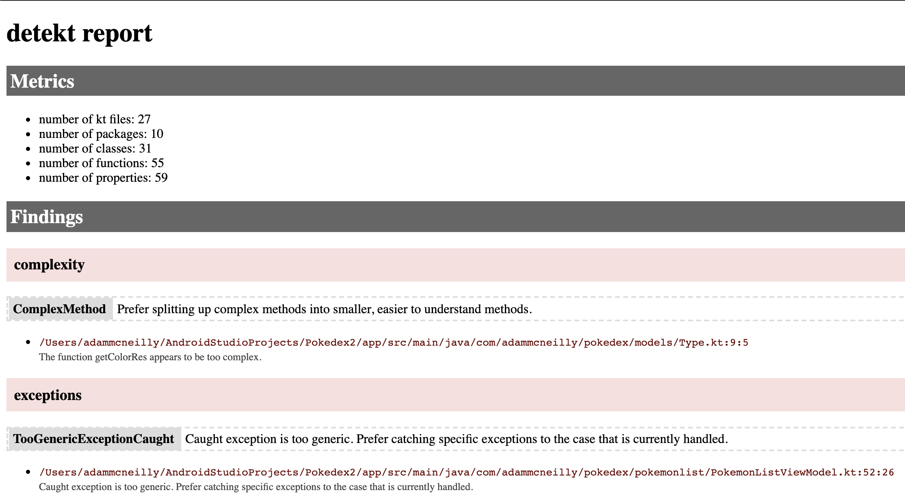

slidenumbers: true
autoscale: true
footer: @AdamMc331<br/>@NYAndroidMeetup
build-lists: true

## Improving Code Quality With Static Analysis

### Adam McNeilly - @AdamMc331

^ Introduce yourself, walk through talk. 

---

# What Do I Mean By Code Quality?

- Code should be well formatted
- Code should be free of code smells

---

# Formatting Code With KtLint

An anti-bikeshedding Kotlin linter with built-in formatter.[^1]

"Bikeshedding" is a term used to describe wasting time on trivial details.

[^1]: https://ktlint.github.io/

---

# What Does KtLint Enforce?

- Consistent indentation
- No wildcard imports
- Consistent spacing
- No empty class bodies
- More: https://github.com/pinterest/ktlint#standard-rules

---

# Why Should We Care?
- Consistency is important
- Create a source of truth that everyone agrees on and no one can argue with
- Allows us to focus on the substance of code reviews instead of styling

---

# Adding KtLint To Our Projects

---

# Adding KtLint To Our Projects[^2]

```groovy
// App module build.gradle

ktlint {
	version = "0.35.0"
	android = true
	enableExperimentalRules = true
	reporters = [ReporterType.PLAIN]
	additionalEditorconfigFile = file("../.editorConfig")
}
```

[^2]: https://github.com/JLLeitschuh/ktlint-gradle

---

# Two Helpful Gradle Tasks

- `./gradlew ktlintCheck`
- `./gradlew ktlintFormat`

---

# KtLint Example

[.code-highlight: 1-2]
[.code-highlight: 4-7]
[.code-highlight: 9-16]
```kotlin
// Long line, no spacing
data class Test(val name:String,val age:Int,val location:String,val isRegistered:Boolean,val test:String)

// Error output:
Test.kt:3:1: Exceeded max line length (100) (cannot be auto-corrected)
Test.kt:3:17: Parameter should be on a separate line (unless all parameters can fit a single line)
Test.kt:3:26: Missing spacing after ":"

// Gets formatted into
data class Test(
    val name: String,
    val age: Int,
    val location: String,
    val isRegistered: Boolean,
    val test: String
)
```

---

# Remembering To Format Code Is Hard

---

# Auto Format With Git Hook[^3]

```bash
// .git/hooks/pre-commit
CHANGED_FILES="$(git --no-pager diff --name-status --no-color --cached | awk '$1 != "D" && $2 ~ /\.kts|\.kt/ { print $2}')"

./gradlew --quiet ktlintFormat -PinternalKtlintGitFilter="$CHANGED_FILES"

echo "$CHANGED_FILES" | while read -r file; do
    if [ -f $file ]; then
        git add $file
    fi
done
```

[^3]: https://github.com/AdamMc331/PokeDex/blob/master/scripts/git-hooks/pre-commit.sh

---

# KtLint Sample


---

# Avoid Code Smells With Detekt[^4]

- Avoid complex methods
- Enforce method counts in classes
- Limit lines of code in a class/method
- Prevent magic numbers

[^4]: https://arturbosch.github.io/detekt/

---

# Why Should We Care?

- Large collections of code (classes, methods, or whatever else) are unmanageable
- Magic numbers, deeply nested methods, and other code smells can be causes of bugs and make them difficult to resolve
- These sorts of code smells are difficult to _detekt_[^5] in a code review

[^5]: I'm sorry...

---

# Adding Detekt To Our Projects

```groovy
// App module build.gradle
detekt {
    filters = ".*/resources/.*,.*/build/.*"
    baseline = file("my-detekt-baseline.xml")
    config = rootProject.files('detekt-config.yml')
}
```

---

# Detekt Is Highly Configurable[^6]

```
// detekt-config.yml
complexity: // Rule Set
  active: true
  ComplexMethod: // Rule
    active: true
    threshold: 10
    ignoreSingleWhenExpression: false
    ignoreSimpleWhenEntries: false
  LongParameterList: // Rule
    active: true
    threshold: 6
    ignoreDefaultParameters: false
  NestedBlockDepth: // Rule
    active: true
    threshold: 4
```

[^6]: https://github.com/arturbosch/detekt/blob/master/detekt-cli/src/main/resources/default-detekt-config.yml

---

# Detekt Is Highly Configurable[^7]

```
// detekt-config.yml
complexity:
  active: true
  TooManyFunctions:
    active: true
    thresholdInFiles: 11
    thresholdInClasses: 11
    thresholdInInterfaces: 11
    thresholdInObjects: 11
    thresholdInEnums: 11
    ignoreDeprecated: false
    ignorePrivate: false
    ignoreOverridden: false
```

[^7]: https://github.com/arturbosch/detekt/blob/master/detekt-cli/src/main/resources/default-detekt-config.yml

---

# Detekt Tasks

- `./gradlew detektGenerateConfig`
- `./gradlew detektBaseline`
- `./gradlew detekt`

---

# HTML Report Output Example



---

# Novoda Gradle Static Analysis Plugin[^8]

```groovy
// ./gradlew evaluateViolations
// Will run all the tools below

staticAnalysis {
    penalty {
        maxErrors = 0
        maxWarnings = 0
    }

    ktlint { }
    detekt { }
    lintOptions { }
    ... { }
}
```

[^8]: https://github.com/novoda/gradle-static-analysis-plugin

---

# When Should I Run This Process?

- As a step in CI flow
- Pre push hook
- Make your build task depend on it

---

# Some Best Practices

I just added these tools, my build failed, what do I do?

- Fix it!
- Modify the threshold for the relevant error
- Suppress this individual case
- Turn off this rule or rule set

---

# Thank You!

Join us: https://okcupid.com/careers

Sample app: https://github.com/adammc331/pokedex
Slides: http://bit.ly/NYAndroid-StaticAnalysis